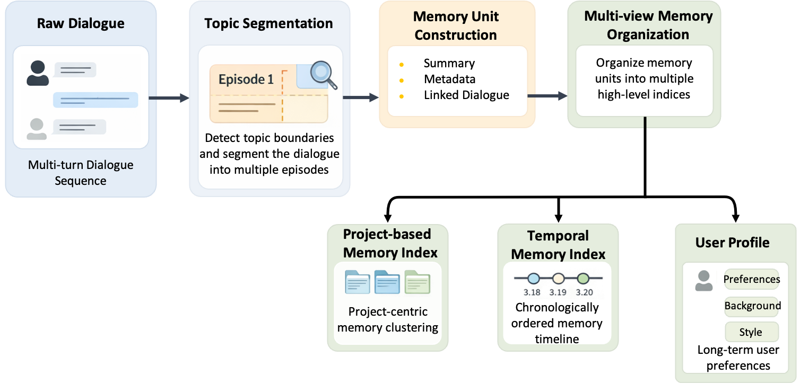
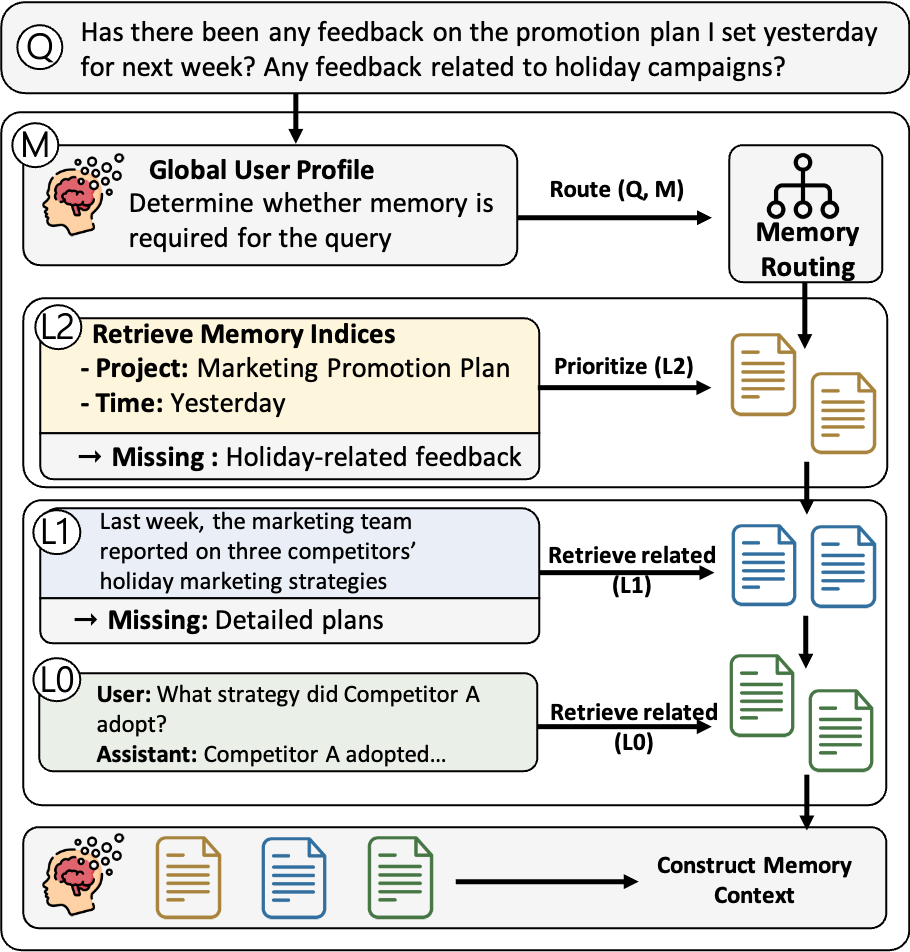

<p align="center">
  <picture>
    
  </picture>
</p>

<p align="center">
  <b>A File-Based Long-Term Memory Plugin for OpenClaw</b>
</p>

<p align="center">
  <a href="./LICENSE"></a>
  <a href="https://github.com/OpenBMB/ClawXMemory"></a>
  <a href="https://github.com/OpenBMB/ClawXMemory/issues"></a>
  <a href="https://www.npmjs.com/package/openbmb-clawxmemory"></a>
</p>

<p align="center">
  <a href="./docs/README_zh.md"><b>简体中文</b></a> &nbsp;|&nbsp; <b>English</b>
</p>

---

**Latest Updates** 🔥

- **[2026.04.01]** 🎉 ClawXMemory is now open source as a file-based long-term memory plugin for OpenClaw

---

## 📖 About ClawXMemory

ClawXMemory is an [OpenClaw](https://github.com/openclaw/openclaw) memory-slot plugin jointly developed by [THUNLP (Tsinghua University)](https://nlp.csai.tsinghua.edu.cn/), [Renmin University of China](http://ai.ruc.edu.cn/), [AI9Stars](https://github.com/AI9Stars), [OpenBMB](https://www.openbmb.cn/home), and [ModelBest](https://modelbest.cn/en), designed for durable long-term memory that stays inspectable and local-first.

The current architecture is markdown-first:

- durable memory is written to markdown files such as `user-profile.md`, `project.meta.md`, `Project/*.md`, and `Feedback/*.md`
- SQLite keeps only runtime control-plane state such as raw captured sessions, settings, and recent traces
- background indexing turns new conversations into file memories
- Dream reorganizes, merges, rewrites, and deletes superseded file memories
- answer-time recall selects a single relevant project, scans file headers, then loads only the selected evidence into the current turn

ClawXMemory provides four core capabilities:

- **File-based long-term memory**: durable user, project, and feedback memories are stored as markdown files that can be inspected directly on disk
- **Background indexing and Dream organization**: new sessions are converted into memory files automatically, then periodically reorganized into cleaner formal project memory
- **Model-guided recall**: recall first decides whether memory is needed, then selects the most relevant project and supporting files instead of stuffing raw history into the prompt
- **Local dashboard and traces**: the built-in UI exposes memory files, runtime overview, and Recall / Index / Dream traces for debugging and review


https://github.com/user-attachments/assets/f6c754a7-f3a1-4dfb-8a43-c60cae2e2f77


### ⚙️ How ClawXMemory Works

ClawXMemory can be summarized as: background file-memory construction + model-guided recall. It quietly turns everyday conversations into reusable long-term memory files.

> [!TIP]
> **Example: continuously advancing a long-running task**
>
> If you use AI to iterate on a paper over time, earlier discussions do not disappear when the context window refreshes, nor do they turn into disconnected text fragments. Instead, the system automatically consolidates them into the current state of that project.
>
> When you later ask, "What stage am I at now?", the system answers directly from that structured state instead of searching for a needle in a haystack across historical chats.

#### 1. Building file memory in the background

During indexing, ClawXMemory turns raw sessions into durable markdown memories in the background:

- `global/User/user-profile.md`
- `projects/<projectId>/project.meta.md`
- `projects/<projectId>/Project/*.md`
- `projects/<projectId>/Feedback/*.md`
- `_tmp` project memory for items that still need Dream organization

The whole process requires no manual action. You stay focused on the current conversation while ClawXMemory quietly extracts reusable long-term context in the background.

<p align="center">
  <picture>
    
  </picture>
</p>

#### 2. Model-guided memory selection

The hard part of long-term memory is not just storing context. It is choosing the right memory files for the current turn.

ClawXMemory handles this by letting the model decide:

- whether memory is needed at all
- whether the query is about user memory or project memory
- which single formal project is most relevant
- which project and feedback files are the best evidence for the current turn

<p align="center">
  <picture>
    
  </picture>
</p>

What enters the prompt is no longer a long history packed in as much as possible, but a small set of memory files that are actually relevant. In short, ClawXMemory is not trying to solve "how to stuff more history into the prompt," but "how to accurately extract and use the long-term context that actually matters."

---

## Quick Start

### Installation

```bash
# Prerequisite: OpenClaw is already installed

# Install from npm (recommended)
npm install -g openbmb-clawxmemory

# Or install from ClawHub
openclaw plugins install clawhub:openbmb-clawxmemory
```

### Start

```bash
openclaw gateway restart
# ClawXMemory Ready! Dashboard -> http://127.0.0.1:39393/clawxmemory/
```

Once the gateway restarts, open `http://127.0.0.1:39393/clawxmemory/` in your browser to access the ClawXMemory dashboard.

If port `39393` is already in use on your machine, explicitly set `uiPort` in the OpenClaw plugin config:

```json
{
  "plugins": {
    "entries": {
      "openbmb-clawxmemory": {
        "config": {
          "uiPort": 40404
        }
      }
    }
  }
}
```

### Development and Debugging

If you need to modify the plugin, debug it, or install it offline, install from source:

```bash
git clone https://github.com/OpenBMB/ClawXMemory.git
cd ClawXMemory/clawxmemory
npm install
npm run relink
```

Common development commands. Run them in `clawxmemory/`:

```bash
# Link the current repo into local OpenClaw for the first time
npm run relink

# Rebuild and reload after changing src/ or ui-source/
npm run reload
```

### Uninstall

If you want to uninstall the plugin and restore native OpenClaw memory ownership, run:

```bash
npm run uninstall
```

You should also manually delete the extension directory that OpenClaw may leave on disk:

```bash
rm -rf ~/.openclaw/extensions/openbmb-clawxmemory
```

### Installation Verification

Run the following commands to check plugin status:

```bash
openclaw plugins inspect openbmb-clawxmemory
# Ensure the output includes "status: loaded"

grep -n '"memory"' ~/.openclaw/openclaw.json
# Ensure the output includes "openbmb-clawxmemory"

openclaw gateway status
# Ensure the output includes "service.runtime.status: running"
```

---

### Contributing

You can contribute through the standard process: **Fork this repository -> open an Issue -> submit a Pull Request (PR)**.

If this project helps your research, a star is appreciated.

---

## 📮 Contact

<table>
  <tr>
    <td>📋 <b>Issues</b></td>
    <td>For technical problems and feature requests, please use <a href="https://github.com/OpenBMB/ClawXMemory/issues">GitHub Issues</a>.</td>
  </tr>
  <tr>
    <td>📧 <b>Email</b></td>
    <td>If you have any questions, feedback, or would like to get in touch, email us at <a href="mailto:yanyk.thu@gmail.com">yanyk.thu@gmail.com</a>.</td>
  </tr>
</table>
