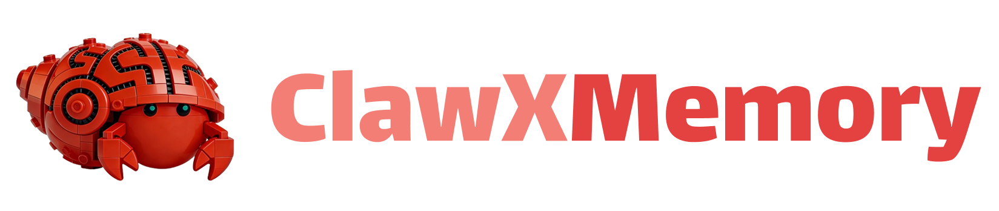
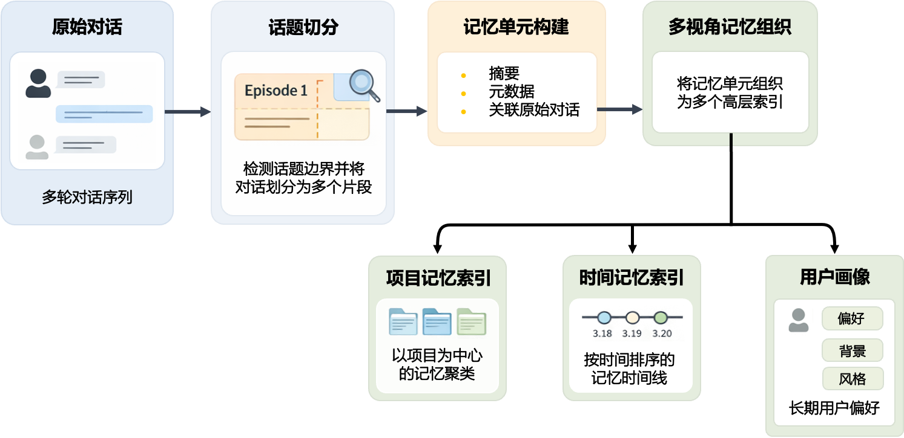
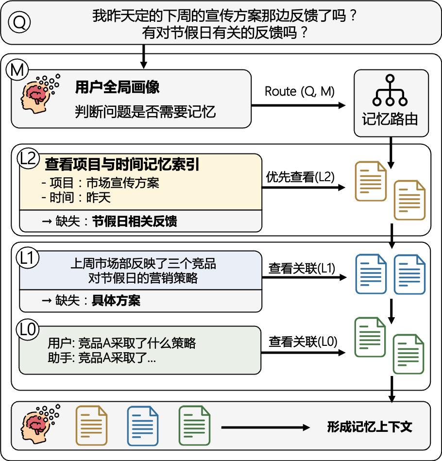

<p align="center">
  <picture>
    
  </picture>
</p>

<p align="center">
  <b>面向长期上下文的多层记忆系统</b>
</p>

<p align="center">
  <a href="../LICENSE"></a>
  <a href="https://github.com/OpenBMB/ClawXMemory"></a>
  <a href="https://github.com/OpenBMB/ClawXMemory/issues"></a>
  <a href="https://www.npmjs.com/package/openbmb-clawxmemory"></a>
</p>

<p align="center">
  <b>简体中文</b> &nbsp;|&nbsp; <a href="../README.md"><b>English</b></a>
</p>

---

**最新动态** 🔥

- **[2026.04.01]** 🎉 ClawXMemory 正式开源，面向长期上下文的多层记忆系统

---

## 📖 关于 ClawXMemory

ClawXMemory 是一款由 [THUNLP (清华大学)](https://nlp.csai.tsinghua.edu.cn/)、[中国人民大学](http://ai.ruc.edu.cn/)、[AI9stars](https://github.com/AI9Stars)、[OpenBMB](https://www.openbmb.cn/home) 与 [面壁智能](https://modelbest.cn/) 联合研发的长期记忆插件，面向 OpenClaw 的持续对话、项目协作和用户画像管理而设计。

当前架构已经收口为 **markdown-first**：

- 长期记忆真源是本地 markdown 文件
- SQLite 只保存运行时控制面状态、原始会话队列和 trace
- Recall、Index、Dream 都围绕 file-memory 工作，而不是围绕旧的多层聚合表

围绕“记住什么、如何组织、以及如何真正用起来”，ClawXMemory 目前提供四个核心能力：

- **文件化长期记忆**：用户画像、项目身份、项目记忆、协作反馈都落为本地 markdown 文件，结构透明、可读、可迁移。
- **自动索引同步**：系统会把原始对话批量提取为 `user-profile.md`、`project.meta.md`、`Project/*.md`、`Feedback/*.md` 等长期记忆文件。
- **Dream 二阶段整理**：系统会基于已有 file-memory 做项目边界审计、去重、合并、删除冗余和用户画像重写。
- **模型驱动 Recall**：回答时由模型决定是否需要记忆、是否需要用户画像或项目记忆，再从单个项目的 `Project/*.md` 与 `Feedback/*.md` 中选择真正相关的文件。


https://github.com/user-attachments/assets/26435229-2e72-4edd-9276-f7d17519cf1c


### ⚙️ 运行机制：ClawXMemory 是如何工作的？

ClawXMemory 的核心运转逻辑可以概括为：**文件化记忆构建 + 模型驱动 Recall + Dream 后整理**。它会在后台把对话沉淀为结构化 markdown 文件，并在真正回答时按需读取这些文件。

> [!TIP]
> **举个例子：持续推进长周期任务**
> 
> 当你使用 AI 持续推进一篇论文时，以往的讨论不会随着上下文窗口的刷新而丢失，也不会变成一堆难以关联的文本碎片；相反，它们会被系统自动汇总为该项目的「当前状态」。
> 
> 当你再次询问“我现在推进到哪一步了”时，系统会直接调取这份结构化状态进行精准解答，而非去海量历史记录中“大海捞针”。

#### 1. 索引同步：把对话写成长期记忆文件

在索引阶段，ClawXMemory 会把原始对话批量提取成几类长期记忆：

| 文件类型 | 核心含义 |
| :--- | :--- |
| `global/User/user-profile.md` | 全局用户画像 |
| `projects/<projectId>/project.meta.md` | 正式项目身份、别名、状态 |
| `projects/<projectId>/Project/*.md` | 项目状态、决策、下一步等项目记忆 |
| `projects/<projectId>/Feedback/*.md` | 交付方式、协作规则等反馈记忆 |
| `projects/_tmp/*` | 尚未完成正式归档的临时项目记忆 |

整个过程无需用户手动整理。你只需专注于自然对话与任务推进，ClawXMemory 会在后台把这些信息沉淀为可复用的长期文件记忆。


<p align="center">
  <picture>
    
  </picture>
</p>

#### 2. Recall：先判断要不要记忆，再按需读取文件

传统记忆系统的痛点往往不在于“没有记忆”，而在于“只有检索，没有判断”。当用户问出“我这个项目现在推进到哪一步了？”、“这个项目你应该怎么给我交付？”或“你还记得我更偏好中文表达吗？”时，真正的难点在于：系统是否知道应该读取用户画像，还是读取某个项目下的 `Project/*.md` 与 `Feedback/*.md`。

ClawXMemory 当前的 Recall 流程是：

1. 先由模型判断当前 query 属于 `none / user / project_memory`
2. 若需要项目记忆，先从 `project.meta.md` 里选出一个最相关项目
3. 再扫描该项目文件头，构建轻量 manifest
4. 由模型从 manifest 中选出真正相关的文件
5. 最后把这些文件全文优先加载进当前回答上下文

这样做的目标不是“把所有记忆都塞进上下文”，而是只把当前真正需要的文件记忆带进来。


<p align="center">
  <picture>
    
  </picture>
</p>

整个寻址过程，更像是一个人类专家在“沿着记忆脉络逐步推演答案”，而非在数据库中盲目执行 `SELECT *`。最终，进入当前模型生成环节的，不再是“尽可能多塞入的冗长历史”，而是经过层层筛选的精准上下文。简而言之，ClawXMemory 致力于解决的并非 “如何向 Prompt 塞入更多历史”，而是 “如何精准提取并运用真正有价值的长期上下文”。


---

## 快速开始

### 安装

```bash
# 前置条件：已安装 OpenClaw

# 通过 npm 安装（推荐）
npm install -g openbmb-clawxmemory

# 或从 ClawHub 安装
openclaw plugins install clawhub:openbmb-clawxmemory
```

### 启动

```bash
openclaw gateway restart
# ClawXMemory Ready! Dashboard -> http://127.0.0.1:39393/clawxmemory/
```

完成，浏览器访问 http://127.0.0.1:39393/clawxmemory/ 即可看到 ClawXMemory 的 Dashboard。

如果本机的 `39393` 已被占用，请在 OpenClaw 插件配置里显式设置 `uiPort`：

```json
{
  "plugins": {
    "entries": {
      "openbmb-clawxmemory": {
        "config": {
          "uiPort": 40404
        }
      }
    }
  }
}
```

### 开发与调试

如果你需要进行二次开发、插件调试、或离线安装，可以从源码安装：

```bash
git clone https://github.com/OpenBMB/ClawXMemory.git
cd ClawXMemory/clawxmemory
npm install
npm run relink
```

常用开发命令，以下命令都在 `clawxmemory/` 目录执行：

```bash
# 首次把当前仓库链接到本地 OpenClaw
npm run relink

# 修改 src/ 或 ui-source/ 后重建并重新加载
npm run reload
```

### 卸载

如果你想卸载插件并恢复 OpenClaw 原生 memory 接管，可以执行：

```bash
npm run uninstall
```

此外还需要把 OpenClaw 可能残留在磁盘上的扩展目录手动删掉：

```bash
rm -rf ~/.openclaw/extensions/openbmb-clawxmemory
```

### 安装验证

执行以下命令检查插件状态：

```bash
openclaw plugins inspect openbmb-clawxmemory
# 确保输出中包含 "status: loaded"

grep -n '"memory"' ~/.openclaw/openclaw.json
# 确保输出中包含 "openbmb-clawxmemory"

openclaw gateway status
# 确保输出中包含 "service.runtime.status: running"
```

---

### 贡献

您可以通过以下标准流程来贡献：**Fork 本仓库 → 提交 Issue → 发起 Pull Request (PR)**。

如果您觉得本项目对您的研究有所帮助，欢迎点亮一颗 ⭐ 来支持我们！

---

## 📮 联系我们

<table>
  <tr>
    <td>📋 <b>Issues</b></td>
    <td>关于技术问题及功能请求，请使用 <a href="https://github.com/OpenBMB/ClawXMemory/issues">GitHub Issues</a> 功能。</td>
  </tr>
  <tr>
    <td>📧 <b>Email</b></td>
    <td>如果您有任何疑问、反馈或想与我们取得联系，请随时通过电子邮件发送至 <a href="mailto:yanyk.thu@gmail.com">yanyk.thu@gmail.com</a>。</td>
  </tr>
</table>
